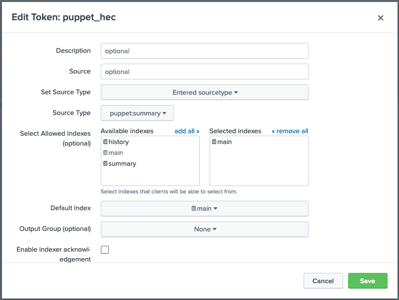
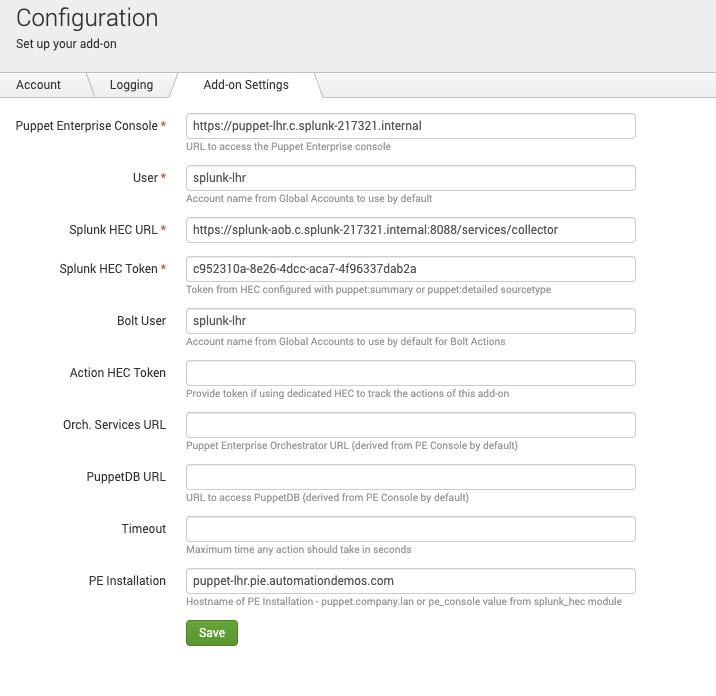

puppet-splunk_hec
==============

#### Table of Contents

1. [Description](#description)
2. [Requirements](#requirements)
3. [Installation](#installation)
4. [Tasks](#tasks)
5. [Advanced Topics](#advanced-topics)
6. [Known Issues](#known-issues)
7. [Breaking Changes](#breaking-changes)
8. [Release Process](#release-process)

## Description
-----------

This is a report processor & fact terminus for Puppet to submit data to Splunk's logging system using Splunk's [HTTP Event Collector](https://docs.splunk.com/Documentation/Splunk/8.0.1/Data/UsetheHTTPEventCollector) service. There is a complimentary app in SplunkBase called [Puppet Report Viewer](https://splunkbase.splunk.com/app/4413/) that generates useful dashboards and makes searching this data easier. The Puppet Report Viewer app should be installed in Splunk before configuring this module.

It is possible to only include data in reports based on specific conditions (Puppet Agent Run failure, compilation failure, change, etc.) See Customized-Reporting in the [Advanced Topics](#advanced-topics) section for details on using that.

Enabling this module is as simple as classifying your Puppet Servers with spluk_hec and setting the Splunk HEC URL along with the token provided by Splunk. This module sends data to Splunk by modifying your report processor settings and indirector routes.yaml.

There are two Tasks included in this module, `splunk_hec:bolt_apply` and `splunk_hec:bolt_result`, that provide similar data for Bolt Plans to submit data to Splunk. Example plans are included which demonstrate task usage.

## Requirements
------------

* Puppet Enterprise or Open Source Puppet
* Splunk

This was tested on both Puppet Enterprise 2019.5.0 & Puppet 6, using stock gems of yaml, json, net::https

## Installation
--------------------

Instructions assume you are using Puppet Enterprise. For Open Source Puppet installations please see the Custom Installation page located in the [Advanced Topics](#advanced-topics) section.

1. Install the [Puppet Report Viewer](https://splunkbase.splunk.com/app/4413/) app in Splunk if not already installed
    * Please see [Splunk Installation](https://docs.splunk.com/Documentation/Splunk/8.0.3/SearchTutorial/InstallSplunk) if you need to install splunk
    * Alternatively you can install splunk via Bolt [Bolt Splunk Installation](https://forge.puppet.com/configuration-management/puppetlabs/deploy-splunk-enterprise-in-minutes)
2. Create an HEC token in Splunk
    1. Navigate to `Settings` > `Data Input` in your Splunk console
    2. Add a new `HTTP Event Collector` with a name of your choice
    3. Ensure `indexer acknowledgement` is not enabled
    4. Click Next and Select the `puppet:summary` sourcetype located under the Puppet Data category
    5. Ensure the `App Context` is set to `Puppet Report Viewer`
    6. Add the `main` index
    7. Set the Default Index to `main`
    8. Click Review and then Submit\
When complete the hec token should look something like this

3. Add the class `splunk_hec` to the PE Infrastructure -> PE Masters node group under Classification
    1. Install the `splunk_hec` module on your Puppet master
        * `puppet module install puppetlabs-splunk_hec --version 0.7.1`
    1. Navigate to `Classification` and expand the `PE Infrastructure` group in the PE console
    2. Select `PE Master` and then `Configuration`
    3. Add the `splunk_hec` class
    4. Enable these parameters:
        ```
        enable_reports = true
        manage_routes = true
        token = something like F5129FC8-7272-442B-983C-203F013C1948
        url = something like https://splunk-8.splunk.internal:8088/services/collector
        ```
    5. Hit save
    6. Run Puppet on the node group, this will cause a restart of the Puppet-Server service
4. Configure the Splunk Puppet Report Viewer with your HEC token like so\

5. Log into the Splunk Console, search `index=* sourcetype=puppet:summary` and if everything was done properly, you should see the reports (and soon facts) from the systems in your Puppet environment

## Tasks
-----------

Two tasks are provided for submitting data from a Bolt plan to Splunk. For clarity, we recommend using a different HEC token to distinguish between events from Puppet runs and those generated by Bolt. The Puppet Report Viewer addon includes a puppet:bolt sourcetype to faciltate this. Currently SSL validation for Bolt communications to Splunk is not supported.

`splunk_hec::bolt_apply`: A task that uses the remote task option to submit a Bolt Apply report in a similar format to the puppet:summary. Unlike the summary, this includes the facts from a target because those are available to bolt at execution time and added to the report data before submission to Splunk.

`splunk_hec::bolt_result`: A task that sends the result of a function to Splunk. Since the format is freeform and dependent on the individual function/tasks being called, formatting of the data is best done in the plan itself prior to submitting the result hash to the task. 

To setup, add the splunk_hec endpoint as a remote target in `inventory.yml`:

```
---
nodes:
  - name: splunk_bolt_hec
    config:
      transport: remote
      remote:
        hostname: <hostname>
        token: <token>
        port: 8088
```

See the `plans/` directory for working examples of apply and result usage.

## Advanced Topics
------------
* [Custom Installation](https://github.com/puppetlabs/puppetlabs-splunk_hec/blob/v0.8.1/docs/custom_installation.md)
* [Advanced Puppet Configuration](https://github.com/puppetlabs/puppetlabs-splunk_hec/blob/v0.8.1/docs/advanced_puppet_configuration.md)
* [Advanced Splunk Configuration](https://github.com/puppetlabs/puppetlabs-splunk_hec/blob/v0.8.1/docs/advanced_splunk_configuration.md)
* [Customized Reporting](https://github.com/puppetlabs/puppetlabs-splunk_hec/blob/v0.8.1/docs/customized_reporting.md)
* [Fact Terminus Support](https://github.com/puppetlabs/puppetlabs-splunk_hec/blob/v0.8.1/docs/fact_terminus_support.md)
* [Puppet Metrics Collection](https://github.com/puppetlabs/puppetlabs-splunk_hec/blob/v0.8.1/docs/puppet_metrics_collector_support.md)
* [SSL Support](https://github.com/puppetlabs/puppetlabs-splunk_hec/blob/v0.8.1/docs/ssl_support.md)
* [Troublshooting and Verification](https://github.com/puppetlabs/puppetlabs-splunk_hec/blob/v0.8.1/docs/troubleshooting_and_verification.md)

## Known Issues
------------
* Integration with puppet_metrics_collection only works on version >= 6.0.0
* SSL Validation is under active development and behavior may change
* Automated testing could use work

## Breaking Changes
-----------
- 0.5.0 splunk_hec::url parameter now expects a full URI of https://servername:8088/services/collector
- 0.5.0 -> 0.6.0 Switches to the fact terminus cache setting via routes.yaml to ensure compatibility with CD4PE, see Fact Terminus Support for guides on how to change it. Prior to deploying this module, remove the setting `facts_terminus` from the `puppet_enterprise::profile::master` class in the `PE Master` node group in your environment if you set it in previous revisions of this module (olders than 0.6.0). It will prevent PE from operating normally if left on.

## Release Process
------------
This module is hooked up with an automatic release process using github actions. To provoke a release simply check the module out locally, tag with the new release version, then github will promote the build to the forge.

Full process to prepare for a release:

Update metadata.json to reflect new module release version (0.8.1)
Run `bundle exec rake changelog` to update the CHANGELOG automatically
Submit PR for changes

Create Tag on target version:
```
git tag -a v0.8.1 -m "0.8.1 Feature Release"
git push upstream --tags
```

Authors
------

P.I.E. Team

P. uppet\
I. ntegrations\
E. ngineering

Chris Barker <cbarker@puppet.com>\
Helen Campbell <helen@puppet.com>\
Greg Hardy <greg.hardy@puppet.com>\
Bryan Jen <bryan.jen@puppet.com>\
Greg Sparks <greg.sparks@puppet.com>
